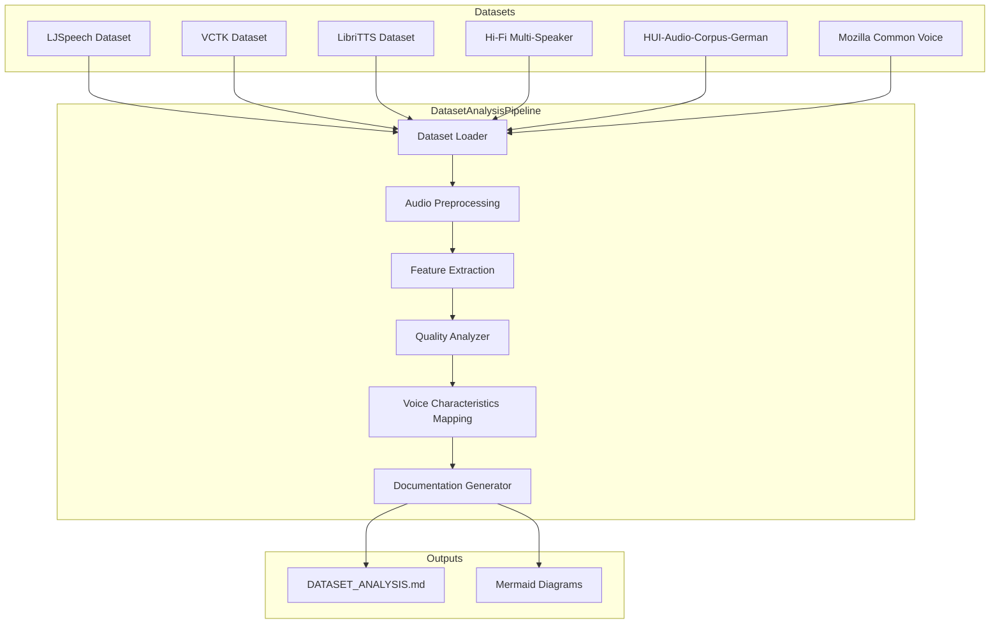
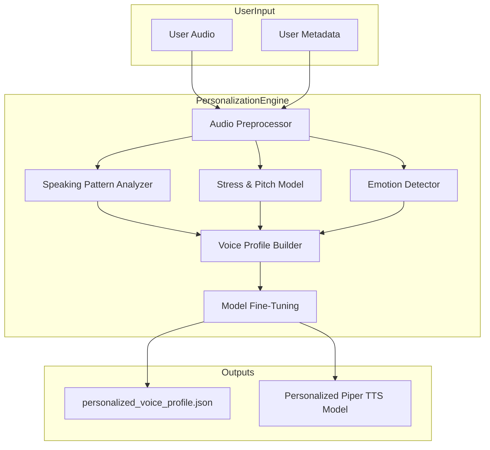

## Task 1 — Dataset Analysis Architecture

```mermaid
graph TD

    subgraph Datasets
        LJSpeech[LJSpeech Dataset]
        VCTK[VCTK Dataset]
        LibriTTS[LibriTTS Dataset]
        HiFi[Hi-Fi Multi-Speaker]
        HUI[HUI-Audio-Corpus-German]
        CommonVoice[Mozilla Common Voice]
    end

    subgraph DatasetAnalysisPipeline
        Loader[Dataset Loader]
        Preprocess[Audio Preprocessing]
        FeatureExtract[Feature Extraction]
        QualityAnalyzer[Quality Analyzer]
        Mapper[Voice Characteristics Mapping]
        DocGen[Documentation Generator]
    end

    subgraph Outputs
        AnalysisReport[DATASET_ANALYSIS.md]
        Diagrams[Mermaid Diagrams]
    end

    LJSpeech --> Loader
    VCTK --> Loader
    LibriTTS --> Loader
    HiFi --> Loader
    HUI --> Loader
    CommonVoice --> Loader

    Loader --> Preprocess
    Preprocess --> FeatureExtract
    FeatureExtract --> QualityAnalyzer
    QualityAnalyzer --> Mapper
    Mapper --> DocGen

    DocGen --> AnalysisReport
    DocGen --> Diagrams
```

## Task 1 — Personalization Engine Architecture

```mermaid
graph TD

    subgraph UserInput
        Audio[User Audio]
        Metadata[User Metadata]
    end

    subgraph PersonalizationEngine
        Preprocessor[Audio Preprocessor]
        SpeakingPattern[Speaking Pattern Analyzer]
        Prosody[Stress & Pitch Model]
        Emotion[Emotion Detector]
        Profile[Voice Profile Builder]
        FineTune[Model Fine-Tuning]
    end

    subgraph Outputs
        VoiceProfile[personalized_voice_profile.json]
        Model[Personalized Piper TTS Model]
    end

    Audio --> Preprocessor
    Metadata --> Preprocessor

    Preprocessor --> SpeakingPattern
    Preprocessor --> Prosody
    Preprocessor --> Emotion

    SpeakingPattern --> Profile
    Prosody --> Profile
    Emotion --> Profile

    Profile --> FineTune
    FineTune --> VoiceProfile
    FineTune --> Model
```
